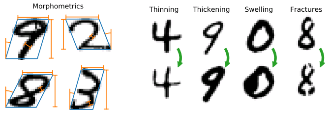

# Morpho-MNIST



[_Morpho-MNIST: Quantitative Assessment and Diagnostics for Representation Learning_](https://arxiv.org/abs/1809.10780)

> Revealing latent structure in data is an active field of research, having brought exciting new models such as variational autoencoders and generative adversarial networks, and is essential to push machine learning towards unsupervised knowledge discovery. However, a major challenge is the lack of suitable benchmarks for an objective and quantitative evaluation of learned representations. To address this issue we introduce Morpho-MNIST. We extend the popular MNIST dataset by adding a morphometric analysis enabling quantitative comparison of different models, identification of the roles of latent variables, and characterisation of sample diversity. We further propose a set of quantifiable perturbations to assess the performance of unsupervised and supervised methods on challenging tasks such as outlier detection and domain adaptation.

If you use these tools or datasets in your publications, please consider citing the accompanying paper with a BibTeX entry similar to the following:

```
@unpublished{castro2018morphomnist,
    author = {Castro, Daniel C. and Tan, Jeremy and Kainz, Bernhard and Konukoglu, Ender and Glocker, Ben},
    title = {{Morpho-MNIST}: Quantitative Assessment and Diagnostics for Representation Learning},
    year = {2018},
    eprint = {arXiv:1809.10780},
    url = {https://arxiv.org/abs/1809.10780},
}
```

**Table of Contents**

- [Morpho-MNIST](#morpho-mnist)
    - [Datasets](#datasets)
    - [API Overview](#api-overview)
        - [`morphomnist.io`](#morphomnistio)
        - [`morphomnist.measure`](#morphomnistmeasure)
        - [`morphomnist.perturb`](#morphomnistperturb)

## Datasets

We distribute the datasets in `.gz` files containing:

- `[train|t10k]-images-idx3-ubyte.gz`: images
- `[train|t10k]-labels-idx1-ubyte.gz`: digit labels, copied from original MNIST
- `[train|t10k]-morpho.csv`: morphometrics table, with columns:
    - `index`: index of the corresponding digit (for convenience, although rows are written in order)
    - `area` (px²), `length` (px), `thickness` (px), `slant` (rad), `width` (px), `height` (px): calculated morphometrics
- `[train|t10k]-pert-idx1-ubyte.gz` (`global` and `local` datasets): perturbation labels
    - `0`: plain; `1`: thinned; `2`: thickened; `3`: swollen; `4`: fractured.
- `README-xxxx.txt`: similar information to the above, for offline reference

Here are the downloads for the datasets used in the experiments in the paper:

| Dataset  | Description               | Download                                                                                         |
| -------- | ------------------------- | ------------------------------------------------------------------------------------------------ |
| `plain`  | plain digits only         | [link](https://drive.google.com/uc?export=download&id=1-E3sbKtzN8NGNefUdky2NVniW1fAa5ZG) (16 MB) |
| `global` | plain+thinning+thickening | [link](https://drive.google.com/uc?export=download&id=1fFGJW0IHoBmLuD6CEKCB8jz3Y5LJ5Duk) (15 MB) |
| `local`  | plain+swelling+fractures  | [link](https://drive.google.com/uc?export=download&id=1ECYmtpPvGH0AkK0JfrGfA2FpOCZK1VX2) (16 MB) |

We additionally provide the datasets affected by a single perturbation, from which `local` and `global` were composed by random interleaving with `plain`:

| Dataset | Description     | Download                                                                                         |
| ------- | --------------- | ------------------------------------------------------------------------------------------------ |
| `thin`  | thinning only   | [link](https://drive.google.com/uc?export=download&id=1q3Bfl1oraKZcIPLHnqkU0whnTiz-AVSP) (13 MB) |
| `thic`  | thickening only | [link](https://drive.google.com/uc?export=download&id=1Uy-SmnEkwq_dptTFuoUtmO9rn2FAbNb8) (16 MB) |
| `swel`  | swelling only   | [link](https://drive.google.com/uc?export=download&id=1tzcInQ5mUdDVOvF5csItbGPrbwVTBkTJ) (17 MB) |
| `frac`  | fractures only  | [link](https://drive.google.com/uc?export=download&id=1Yrl_00-SFZZPyRnqjPsbAFlv6uwBZtJd) (16 MB) |

Finally, we also make available the pre-computed morphometrics for the *original* MNIST images (only the `.csv` tables; the images and labels can be downloaded from [LeCun's website](http://yann.lecun.com/exdb/mnist/)):

| Dataset    | Description                  | Download                                                                                          |
| ---------- | ---------------------------- | ------------------------------------------------------------------------------------------------- |
| `original` | original MNIST morphometrics | [link](https://drive.google.com/uc?export=download&id=11rWisIshN78ZJMPYN0YC6UEKX5484B-n) (3.2 MB) |

The folder with all datasets for download can be accessed [here](https://drive.google.com/drive/folders/1ZzTBfXUKa4JW0lHkUIJ1qFCCSkOqWFvL).

## API Overview

The most relevant modules for end-users are `io`, `measure` and `perturb`, whose API we summarise below. For further details on these and on the other modules, please refer to the respective docstrings. The default arguments to all functions and constructors are the ones used in the paper and work well in practice.

### `morphomnist.io`

Utility functions to load and save MNIST data files in [IDX format](http://yann.lecun.com/exdb/mnist/). Can read and write plain or `gzip`-ed files, given the `*.gz` file extension.

```python
input_images = load_idx("input_dir/images-idx3-ubyte.gz")
# ...
save_idx(output_images, "output_dir/images-idx3-ubyte.gz")
```

### `morphomnist.measure`

Functions to compute morphometrics for a single MNIST image:

```python
area, length, thickness, slant, width, height = measure_image(image)
```

or for a batch of images, with support for parallel processing (can take up to a few minutes; displays a progress bar if [`tqdm`](https://tqdm.github.io/) is installed):

```python
with multiprocessing.Pool() as pool:
    metrics = measure_batch(images, pool=pool)  # A pandas.DataFrame
```

### `morphomnist.perturb`

Contains a number of subclasses of `Perturbation`, which apply a parametrisable transformation to a high-resolution binary MNIST image:

- `Perturbation` (abstract)
    - `Thinning`: Thin a digit by a specified proportion of its thickness.
    - `Thickening`: Thicken a digit by a specified proportion of its thickness.
    - `Deformation` (abstract)
        - `Swelling`: Create a local swelling at a random location along the skeleton. Coordinates within a specified radius of the centre location are warped according to a radial power transform.
    - `Fracture`: Add fractures to a digit. Fractures are added at random locations along the skeleton, while avoiding stroke tips and forks, and are locally perpendicular to the pen stroke.

`Perturbation` instances are callable, taking as argument a `morphomnist.morpho.ImageMorphology` object constructed from the input image.

Below is a simple usage example applying a random perturbation (or none) to each of a collection of `images`:

```python
import numpy as np
from morphomnist import io, morpho, perturb

perturbations = (
    lambda m: m.binary_image,  # No perturbation
    perturb.Thinning(amount=.7),
    perturb.Thickening(amount=1.),
    perturb.Swelling(strength=3, radius=7),
    perturb.Fracture(num_frac=3)
)

images = io.load_idx("input_dir/images-idx3-ubyte.gz")
perturbed_images = np.empty_like(images)
perturbation_labels = np.random.randint(len(perturbations), size=len(images))
for n in range(len(images)):
    morphology = morpho.ImageMorphology(images[n], scale=4)
    perturbation = perturbations[perturbation_labels[n]]
    perturbed_hires_image = perturbation(morphology)
    perturbed_images[n] = morphology.downscale(perturbed_hires_image)
io.save_idx(perturbed_images, "output_dir/images-idx3-ubyte.gz")
io.save_idx(perturbation_labels, "output_dir/pert-idx1-ubyte.gz")
```
